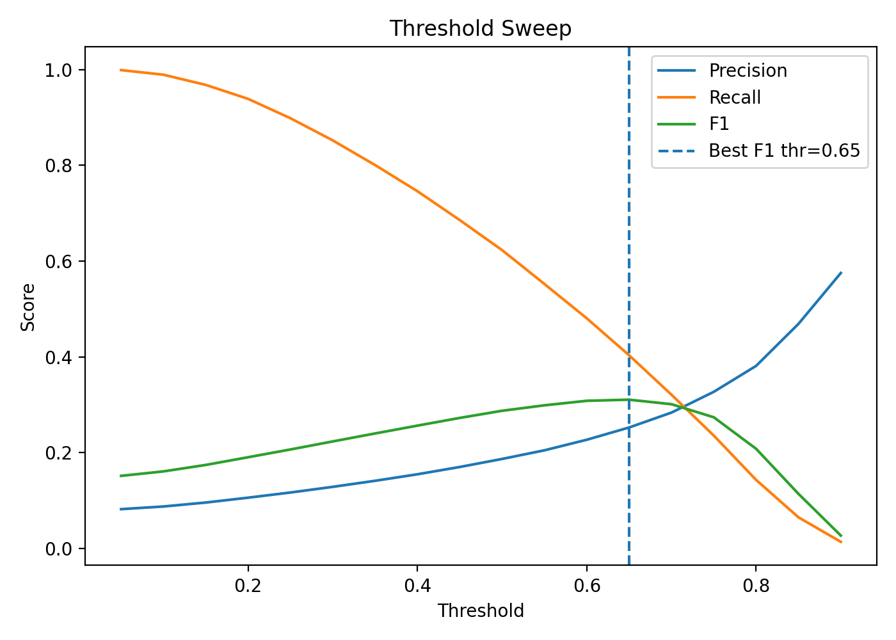
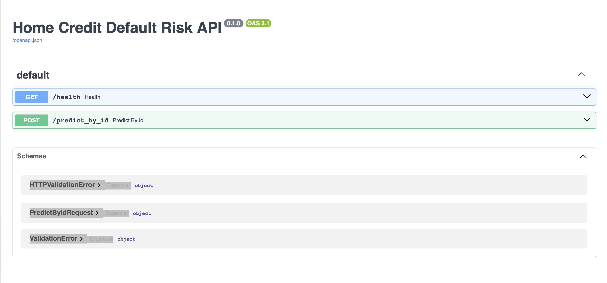
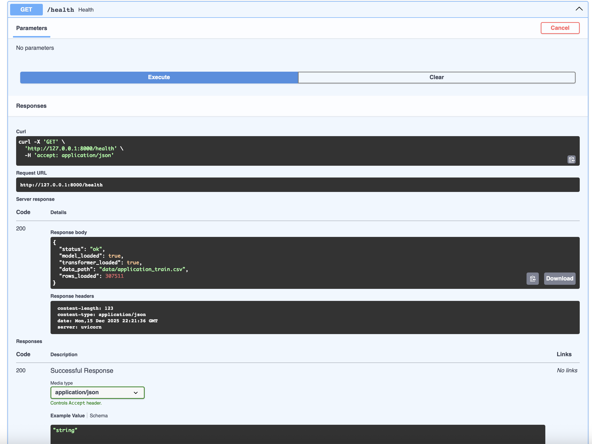
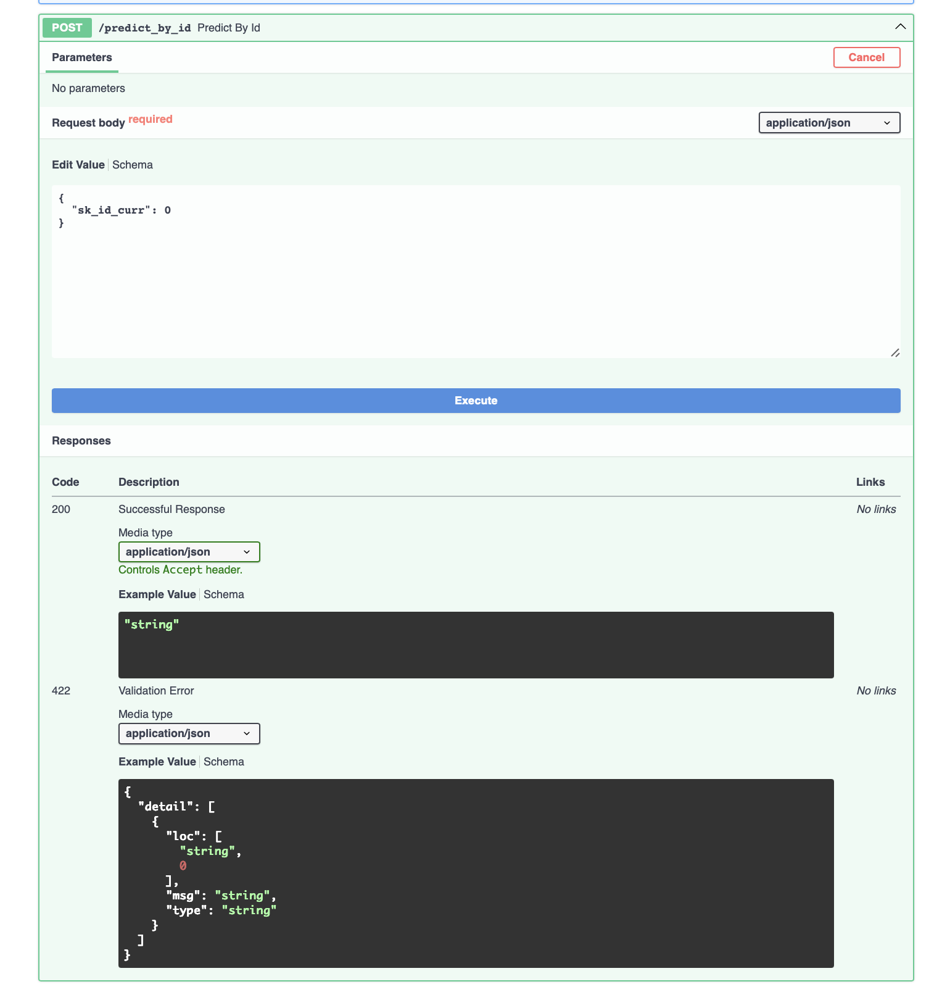
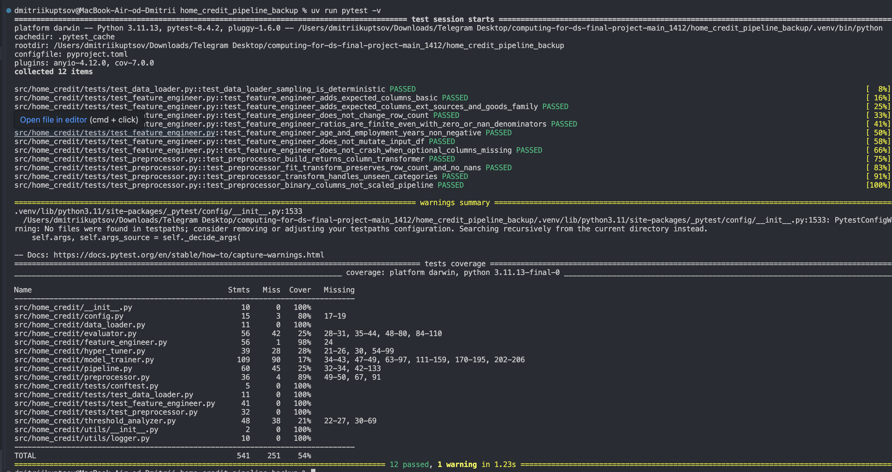

# Home Credit Default Risk — ML Library

This library implements an end-to-end machine learning pipeline for predicting default risk on the [Home Credit dataset](https://www.kaggle.com/competitions/home-credit-default-risk).  
It is built as a modular codebase that can be extended over time.

## What we built

- **Config-driven pipeline** (YAML): all key paths and settings are controlled via `config/default.yaml`.
- **Data loading**: reads `application_train.csv`.
- **Feature engineering**: adds simple, domain-based application features (ratios, EXT_SOURCE aggregates, anomaly flags).
- **Preprocessing**: sklearn `ColumnTransformer` for numeric/categorical data (imputation + scaling + one-hot encoding).
- **Leakage-safe cross-validation**: preprocessing is fit only on training folds and applied to validation folds.
- **Model training**: LightGBM classifier with class-imbalance handling (`scale_pos_weight`).
- **Evaluation**:
  - saves metrics to JSON (`ROC-AUC`, `PR-AUC`, `F1`, precision/recall, etc.)
  - saves a confusion matrix plot
- **Threshold analysis** (optional): sweeps probability thresholds and plots precision/recall/F1 trade-offs.
- **Artifacts**: saves the trained model and preprocessor for inference (`joblib`).
- **API**: FastAPI endpoint that returns a prediction for an existing application by `SK_ID_CURR`.
- **Unit tests**: tests for the feature engineering and preprocessing components.


## Guidelines to Scale the Library (Adding New Components)

The main rule: **extend by adding new modules/classes**, not by editing the pipeline logic every time.  
The pipeline should stay a thin “orchestrator”, while features/preprocessing/models/metrics live in their own components.

Below are the conventions we follow so new team members can contribute safely and consistently.

---

### 1) Adding a new feature set

**Goal:** add new features without breaking training, inference, or the API.

**Where:**
- Application-level features: `src/home_credit/feature_engineer.py`
- (Later) Multi-table aggregates: create a separate module, e.g. `src/home_credit/features/bureau_features.py`

**Design principle:** each “feature set” should be **independent** and have one responsibility.

**Contract**
- Input: raw dataframe with one row per application (`SK_ID_CURR`)
- Output: same dataframe + new columns (same number of rows)

**Rules that matter in practice**
- **Schema stability:** the function must not drop or reorder existing columns.
- **No row expansion:** never merge in a way that duplicates rows; if you join aggregates, ensure 1 row per `SK_ID_CURR`.
- **Safe computations:** avoid `inf`/`-inf` and uncontrolled NaNs.
  - Use `replace(0, np.nan)` for denominators and then `.fillna(0)` (or keep NaN and let imputers handle it).
- **Explicit naming:** feature names must be searchable and grouped:
  - `APPS_...` for application table
  - `BUREAU_...` for bureau aggregates
  - `PREV_...` for previous_application aggregates
  - `INST_...`, `POS_...`, `CC_...` similarly
- **Document intent in code:** one short comment per block explaining “what signal it captures”.

### 2) Adding a new Preprocessor

**Goal:** support new preprocessing strategies without changing model code.  
**Where:** `src/home_credit/preprocessor.py`

#### Contract
`build(X_df) -> ColumnTransformer` that can `fit` and `transform`.

#### Rules that matter in practice
- Preprocessor must be **deterministic** for a given `X_df` (same columns → same transformer).
- **Fit only on training data (fold-wise)** to prevent leakage.
- No target-aware logic inside preprocessing (do **not** use `TARGET` / labels).
- Prefer config switches over branching logic in the pipeline, e.g.:
  - `preprocessing.scaler: standard|none`
  - `preprocessing.categorical: onehot|target_encoding` *(future)*
- Do not force dense matrices unless necessary. (Sparse is fine for OneHot + LightGBM.)

#### When to create a new class
Create a new preprocessor class if:
- you introduce a different encoding strategy (target encoding, hashing)
- you introduce feature selection
- you need separate preprocessing for specific models

#### Tests to add
Add/extend `tests/test_preprocessor.py`:
- transformer builds on a mixed-type toy dataframe
- fit/transform returns consistent shape
- missing values do not crash
- unseen categorical values do not crash (`handle_unknown="ignore"`)

### 3) Adding a new Model / Trainer

**Goal:** swap models without rewriting pipeline steps.

**Where**
- current: `src/home_credit/model_trainer.py`
- recommended later: `src/home_credit/trainers/` *(one file per model)*

#### Contract (trainer interface)
- `cross_validate_oof(X_df, y, ...) -> (mean_score, oof_proba)`
- `fit_final(X_df, y, ...) -> None` *(saves artifacts)*
- `predict_proba_test(X_test_df) -> np.ndarray` *(optional helper)*

#### Rules that matter in practice
- **Leakage safety is non-negotiable:** preprocessing must be fitted **inside each fold**.
- **OOF predictions are the evaluation source:** never report metrics on the same data used to fit the final model.
- **Artifact consistency:** every trainer must save:
  - model file (`artifacts/*.joblib`)
  - preprocessor (`artifacts/preprocessor.joblib`)
  so API/inference always works the same way.

#### How to extend cleanly
- Add a `model.type` in YAML and implement a small factory (e.g. `"lgbm"`, `"xgb"`, `"logreg"`, etc.).
- Keep model-specific params inside `config/default.yaml`.

### 4) Adding Metrics and Evaluation Outputs

**Goal:** allow adding metrics/plots without touching training logic.

**Where**
- metrics + confusion matrix: `src/home_credit/evaluator.py`
- threshold plots: `src/home_credit/threshold_analyzer.py`

#### Rules that matter in practice
- Metrics must be computed from **OOF probabilities** (or a holdout set), **not** from training probabilities.
- Every metric should be:
  - clearly named
  - JSON-serializable
  - stable across runs (avoid random thresholds unless stored)
- Plots go to `artifacts/` and should not block training if plotting fails.

#### Recommended metric policy
- Always compute: `ROC_AUC`, `PR_AUC`
- Threshold-dependent metrics (`F1`, `precision`, `recall`) must state the threshold used (and store it).


## What we built

- **Config-driven pipeline (YAML)**  
  All paths and key switches (sampling, tuning, threshold analysis, output paths) are controlled via `config/default.yaml`, so the pipeline runs with one command and can be reproduced.


- **Data loading**  
  Loads `data/application_train.csv` (optional subsampling for fast debugging). The train target column (`TARGET`) is taken from config.

- **Feature engineering (application-level)**  
  Adds lightweight, interpretable domain features on top of the raw application table:
  - credit/income and annuity/income ratios
  - EXT_SOURCE mean/std signals
  - handling of the known `DAYS_EMPLOYED = 365243` anomaly + anomaly flag
  - additional simple ratios using `AMT_GOODS_PRICE`, `CNT_FAM_MEMBERS` when available  
  Feature logic is written to be robust to missing columns (no crashes).

- **Preprocessing**  
  Builds an sklearn `ColumnTransformer`:
  - numeric: impute + scale
  - binary: impute most frequent
  - categorical: impute + one-hot encoding (`handle_unknown="ignore"`)  
  The transformer is saved as an artifact for inference.

- **Leakage-safe cross-validation (OOF)**  
  Uses stratified K-fold CV where preprocessing is **fit only on the training fold** and applied to the validation fold. The pipeline collects **out-of-fold probabilities** for evaluation.

- **Model training**  
  Trains a LightGBM classifier with automatic class imbalance handling via `scale_pos_weight`. After CV, fits a final model on the full training set and saves it for inference.

- **Evaluation outputs**  
  - Writes a `metrics.json` file (ROC-AUC, PR-AUC, F1, precision/recall, accuracy, best threshold).
  - Saves a confusion matrix plot to `artifacts/`.  
 
```json
{
  "ROC_AUC": 0.7641999076917151,
  "PR_AUC": 0.24904230238694272,
  "Balanced_Accuracy": 0.6528833583383922,
  "F1": 0.3111913900805298,
  "Precision": 0.24842585916846913,
  "Recall": 0.4163947633434038,
  "Accuracy": 0.8511890631554644,
  "Best_Threshold": 0.6421819241652458
}
```

- **Threshold analysis**  
  Sweeps probability thresholds to visualize precision/recall/F1 trade-offs and saves a threshold plot to `artifacts/`.



- **Artifacts & reproducibility**  
  Saves:
  - `artifacts/lgbm_model.joblib`
  - `artifacts/preprocessor.joblib`
  - evaluation JSON + plots  
  This makes inference and the API independent from the training run.

- **API (FastAPI)**  
  Provides an endpoint `POST /predict_by_id` that returns the predicted default probability for an **existing** application by `SK_ID_CURR` (read from `application_train.csv`).







- **Unit tests**  
  Adds unit tests for:
  - `FeatureEngineer` (expected columns, stability, finiteness, no mutation)
  - `Preprocessor` (build + fit/transform behavior)


